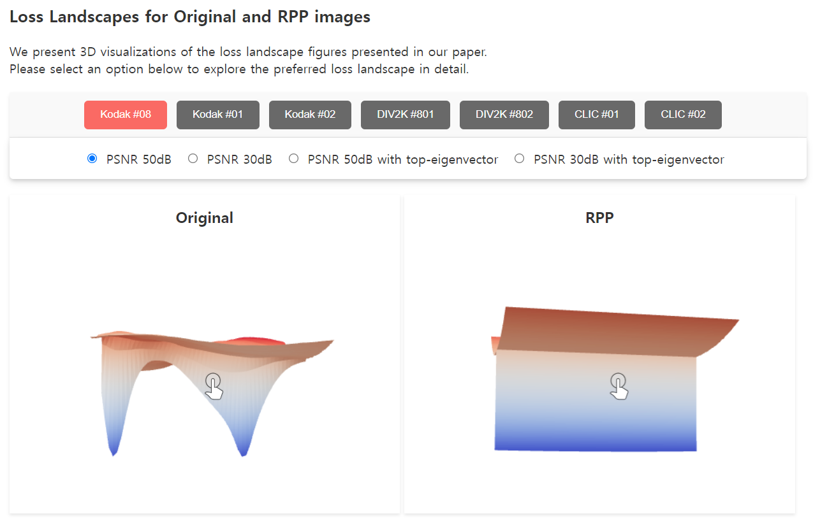

# In Search of a Data Transformation That Accelerates Neural Field Training
### [Paper](https://arxiv.org/abs/2311.17094) | [Hugging Face](https://huggingface.co/papers/2311.17094)

Junwon Seo\*, Sangyoon Lee\*, Kwang In Kim, Jaeho Lee<br><br>
Pohang University of Science and Technology (POSTECH)


<br>

This is the official Github page for the paper "In Search of a Data Transformation That Accelerates Neural Field Training" (CVPR 2024).

<br>

## SIREN experiments

Our experiments on SIREN are based on the official code for the paper ["Implicit Neural Representations with Periodic Activation Functions"](https://github.com/vsitzmann/siren).<br>

This repository does not contain any image datasets used in the manuscript.<br>
We used [Kodak](https://r0k.us/graphics/kodak/), [DIV2K](https://data.vision.ee.ethz.ch/cvl/DIV2K/), and CLIC datasets for our main experiments. (Section 3.1. in our paper for details)
<br><br>

### Setup

To run a single SIREN experiment, execute the following command:

```
$ cd SIREN
### example code
$ python siren_DT.py --experiment_name=1 --lr=-10 --sidelength=512 --num_workers=16 --project=SIREN --max_steps=10000 --directory=kodak_ori --batch_size=18 --gpu_num=0 --type=origin
```
<br>

To run all experiments for the Kodak datset, use the following script:

```
$ cd SIREN
$ sh run_siren.sh
```

Descriptions of the command line flags are in `/SIREN/README.md`. 
<br>

## Loss Landscape

All loss landscapes in our paper can be visualized in the [Demo](https://huggingface.co/spaces/lyunm1206/Interactive_Loss_Landscapes) with 3D interactive versions.<br>
<br>


## Citation

```
@inproceedings{RPP,
author = {Junwon Seo and Sangyoon Lee and Kwang In Kim and Jaeho Lee},
title = {In Search of a Data Transformation That Accelerates Neural Field Training},
year = {2024},
booktitle = {Proceedings of the IEEE/CVF Conference on Computer Vision and Pattern Recognition (CVPR)}
}
```